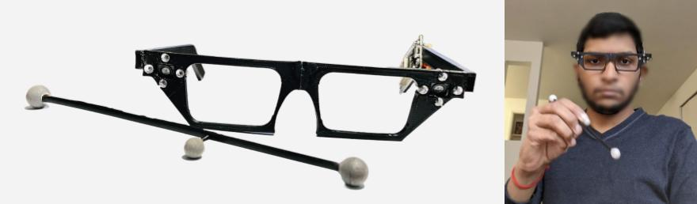

# RetroSphere



This repository contains the hardware details and the associated Arduino Firmware library for RetroSphere. For more information on the project and tutorial, visit the wiki or the website (<https://retrospherev1.github.io/>) 

## Hardware components / Prerequisites
1. Pixart IR tracker (PAJ7025R3) <https://www.codico.com/en/paj7025r3-sample-kit-cdc> - 2 Nos
2. Optek OP294 IR LEDs <https://www.mouser.sg/ProductDetail/Optek-TT-Electronics/OP294?qs=N5kmjX%2FbzE4V2o1kTKg1ww%3D%3D> - 8 Nos
3. ESP32-WROOM-32 Dev board <https://www.espressif.com/sites/default/files/documentation/esp32-wroom-32_datasheet_en.pdf>
4. 600 0hm Resistor
5. Soldering station
6. Wires

## Hardware Connections


## Firmware setup

Setup
Download the library as a zip folder and install it as described here: https://www.arduino.cc/en/Guide/Libraries ("Importing a .zip Library")

Working
Connect the board following the tutorial on the wiki.
Step 1: Stereo IR camera calibration
Run the firmware in Camera Calibration/Camera_Calib.ino. The hardware is now calibrated and ready for tracking.

For **3DoF Tracking of the Retroreflective stylus**, Flash the Firmware in 3DoF tracking firmware/3dof_tracker.ino.

For **6DoF Tracking of the Retroreflective stylus**, Flash the Firmware in 6DoF tracking firmware/6dof_tracker.ino.

# Unity Demo applications

For running our Unity applications, please download our Unity demos as unity apps/unity_app_object_manipulation.zip. For more details on running our Unity Demos, please refer to the readme.md inside unity apps folder.
## References

If you use RetroSphere in your research, please reference it as:

```bibtex
@article{Balaji2022RetroSphere,
  title = {{RetroSphere: Self-Contained Passive 3D Controller Tracking for Augmented Reality}},
  author = {Balaji, Ananta and Kimber, Clayton and Li, David and Wu, Shengzhi and Du, Ruofei and Kim, David},
  journal = {Proceedings of the ACM on Interactive, Mobile, Wearable and Ubiquitous Technologies},
  year = {2022},
  volume = {6},
  number = {4},
  publisher = {ACM},
  month = {Dec.},
  pages = {157:1--157:36},
  series = {IMWUT},
  doi = {10.1145/3569479},
}
```

or

```txt
Ananta Balaji, Clayton Kimber, David Li, Shengzhi Wu, Ruofei Du, and David Kim. 2022. RetroSphere: Self-Contained Passive 3D Controller Tracking for Augmented Reality. Proceedings of the ACM on Interactive, Mobile, Wearable and Ubiquitous Technologies, 6(4), 157:1-157:36. DOI: https://doi.org/10.1145/3569479
```
