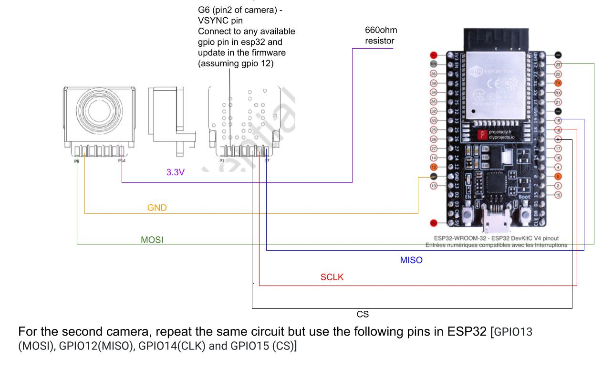
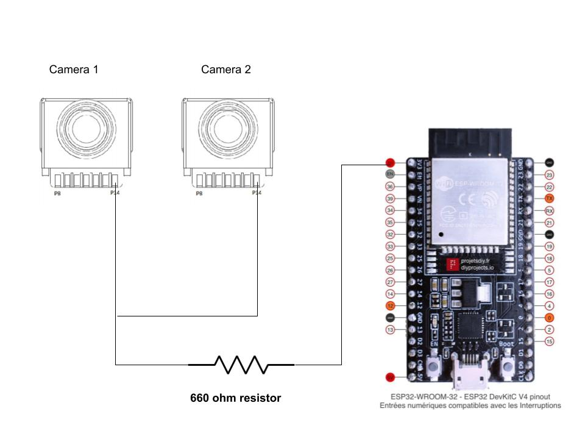

# RetroSphere

![More Details on step-by-step firmware_for_RetroSphere and Unity 3D experiences will be released soon!]
Hardware details and drivers for the RetroSphere prototype.





## References

If you use RetroSphere in your research, please reference it as:

```bibtex
@inproceedings{Balaji2021RetroSphere,
  title = {{RetroSphere: Self-Contained Passive 3D Controller Tracking for Augmented Reality}},
  author = {Balaji, Ananta and Kimber, Clayton and Li, David and Wu, Shengzhi and Du, Ruofei and Kim, David},
  year = {2021},
}
```

or

```txt
Ananta Balaji, Clayton Kimber, David Li, Shengzhi Wu, Ruofei Du, and David Kim. 2021. RetroSphere: Self-Contained Passive 3D Controller Tracking for Augmented Reality. 2021.
```

We would like to also thank Levana Chen, Xinyun Huang, and Ted Bisson for
integrating DepthLab with AR Foundation.
